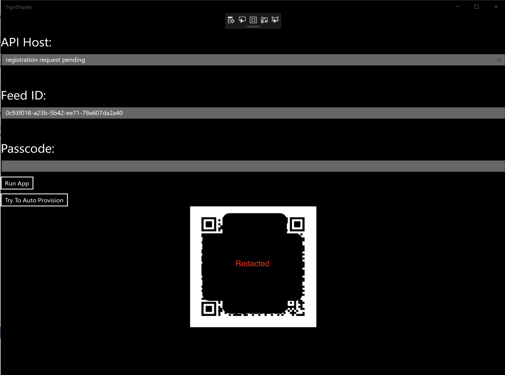
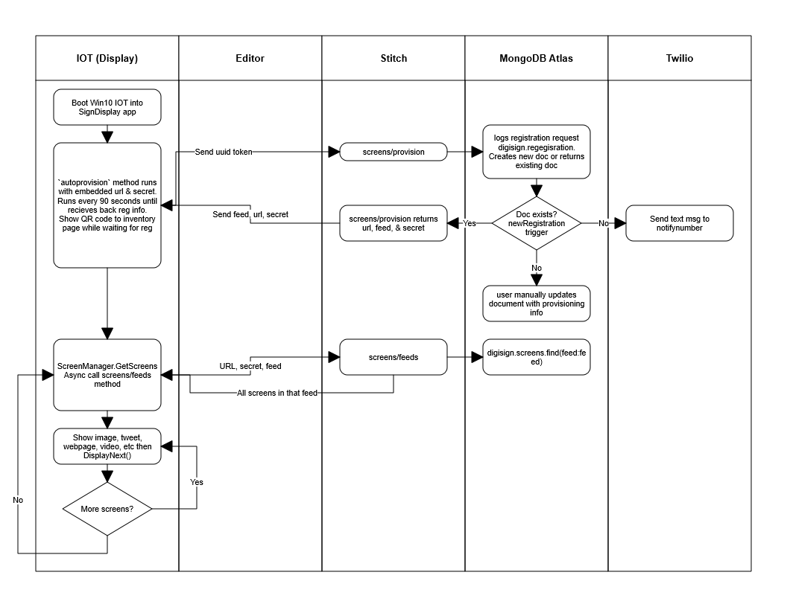

# CarniDigiSign_IOT

# History
Previously, this was part of a three piece solution: this app to display screens on Windows10IOT, another app to [create signs](https://github.com/graboskyc/CarniDigiSign_App), and a third app which [acts as the server](https://github.com/graboskyc/CarniDigiSign_Server).

Now this has been simplified as the server solution is legacy in favor of using MongoDB Atlas as the cloud database and MongoDB Stitch as the serverless platform for REST APIs.

# About this repo

So now this app will display signs in rotation and the other project still [creates signs](https://github.com/graboskyc/CarniDigiSign_App).

The end result is a simple to deploy and manage utility for digital signage. 

These two apps are UWP apps. The intent of this one is to be deployed on a Raspberry Pi or Intel Compute Stick running Windows 10 IOT to display the digial signage

# Sign type support

Supported options for the type of screen are:
* Hidden - _hide_ - The record is ignored but kept in the database
* Image - _image_ - A URL to an image
* Text - _text_ - The Text field is displayed in line
* Tweet - _tweet_ - The URL to a specific tweet. The Twitter API is called to retrieve and it is formatted
* Video - _video_ - A URL to a video file supported by the UWP video element
* Web - _web_ - A URL to a website

# Deployment
* Deploy a Raspberry Pi with Windows 10 IOT
* Connect it to the network
* Sign up for MongoDB Atlas 
* Create a cluster and a database called `digisign` with collections for `registration` and `screens`
* Connect a Stitch application to MongoDB Atlas cluster
* Install the `stitch-cli` and load the Stitch folder into that app. Note that each config file is expecting a string in the `secret` field above the `SECRET_AS_QUERY_PARAM` which I have omitted when I uploaded it to source control. Put your credentials and phone number in the Twilio section and Values section or delete that trigger and twil folders.
* Download Visual Studio 2017, open the solution in `SignDisplay`
* Edit the `Resources.resw` with the URL of the stitch app above and the secret you created above
* Deploy the app onto the Pi
* It will wait on the regirstration page seen above in the screenshot and should send a text message to you
* Log into Atlas and manually enter the `feed`, `baseurl`, etc as expected for this to work
* Every 90 seconds or so the Pi will update to check if it is registered and start the slideshow

# Data flow 
